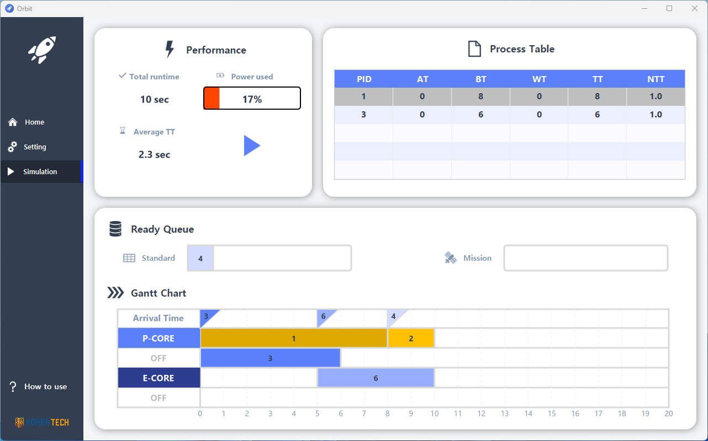

# Orbit
운영체제 프로세스 스케줄링 시뮬레이터

KOREATECH 2023-1학기 운영체제 팀프로젝트 최우수상

## 자료실
- [프로그램 설치](https://github.com/LazoYoung/toast-os/releases)
- [프로젝트 개요](https://file.notion.so/f/f/44c71e57-9d74-496f-a879-bdc789627a19/adeba1c4-914e-4085-957a-d12441369766/CSE132_04_report_final_ver2.pdf?table=block&id=c81d4a87-9e7e-4b86-9ecb-035be0ac81b2&spaceId=44c71e57-9d74-496f-a879-bdc789627a19&expirationTimestamp=1729224000000&signature=LsTJ3AyUDjJmjjYgzyTvLxrWKFcldX9GVhuRWpTdEy8&downloadName=CSE132_04_report_final_ver2.pdf)
- [기능명세서](https://www.notion.so/Scheduler-API-adfdeb0754d94d7eb195fc12540fbe5e)

## 제작진
### Team TOAST
- 박찬영: API 개발, 알고리즘 설계, 팀 관리
- 박한수: API 개발, 알고리즘 설계, QA 관리
- 이우탁: UI 설계, 알고리즘 설계, PPT 제작
- 표승현: 발표, 알고리즘 설계, 보고서 제작
